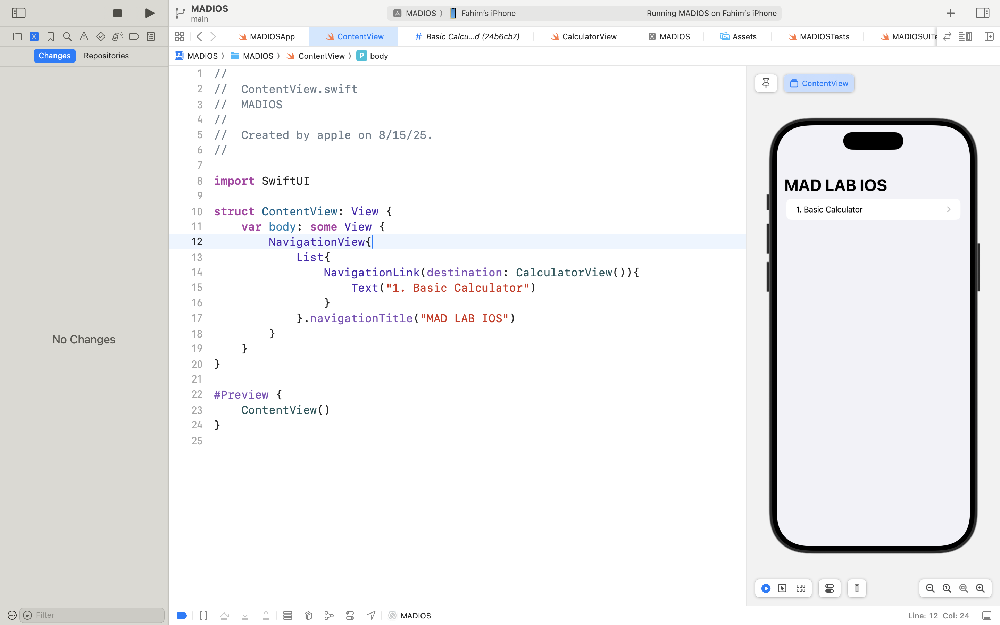
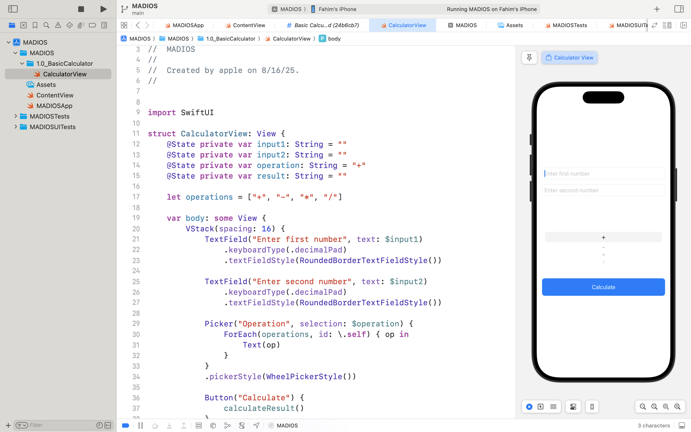
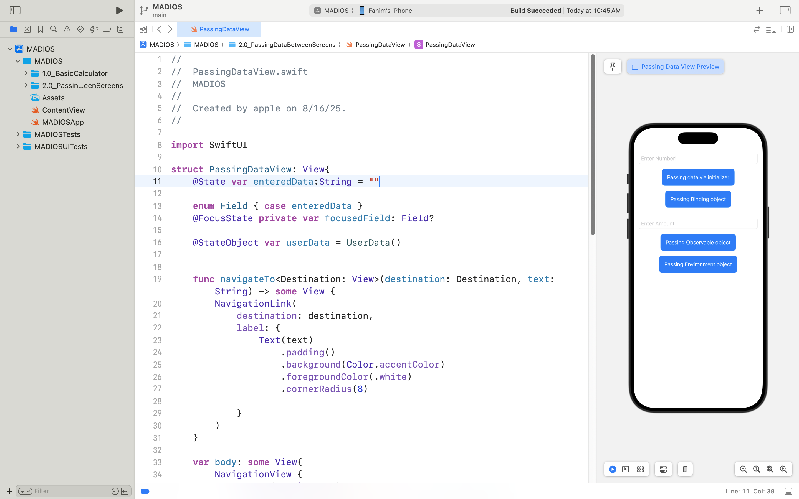
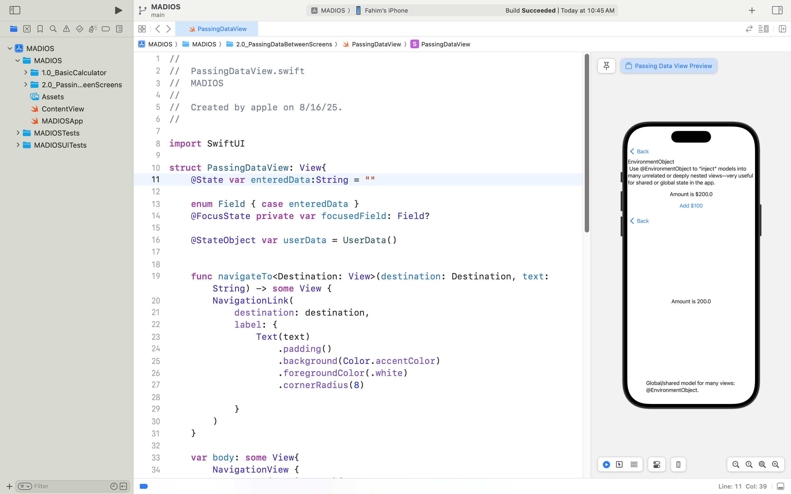

# Swift & iOS App Development Basics

Welcome to the **Swift & iOS App Development Basics** repository!  
This project is designed as a hands-on introduction to iOS app development using Swift and SwiftUI. Here, you’ll find basic project examples, practical lab exercises, and supporting resources to build foundational skills in mobile development.

---

## Project Overview

- **Objective**: Learn the basics of Swift programming and iOS app development.
- **Target Audience**: Beginners and students interested in mobile app development.
- **Tech Stack**: Swift, SwiftUI, Xcode, iOS Simulator.

---

## Repository Structure
<pre> ``` 
/
|-- Labs/
| |-- Lab01_BasicCalculator/
| | |-- CalculatorView.swift
| |
| |-- Lab0_MenuNavigation/
| | |-- MenuView.swift
| | |-- README.md
|-- README.md
   ``` </pre>


- Each lab folder contains:
  - Swift source code (`.swift` files)
  - Lab-specific readme describing objectives and steps
  - A `screenshots/` directory with images showcasing app output/behavior

---

## Getting Started

1. **Prerequisites**
    - macOS with latest Xcode installed.
    - Basic understanding of programming concepts.
2. **Running the Labs**
    - Open the relevant `.swift` files in Xcode.
    - Build and run on the iOS Simulator or a physical iOS device.

---

## Labs Included


- **Lab 0: Basic Menu Navigation**
  - Build a menu-driven navigation with SwiftUI.
  - Screenshot(s) in `Labs/Lab0_MenuNavigation/` display the functional menu and navigation to Calculator.
  - 


- **Lab 1: Basic Calculator**
  - Implement simple arithmetic operations using SwiftUI.
  - Screenshot(s) in `Labs/Lab01_BasicCalculator/screenshots/` showcase input, operation, and result display.
  - 

- **Lab 2: Add basic navigation and multiple methods for passing data between screens**
  - Implements screen navigation using NavigationLink
  - Demonstrates passing data via initializer, binding, and observable objects
  - Screenshot(s) in `Labs/Lab02_PassingData/screenshots/` showcase input, operation, and result display.
  
  


*...More labs will be added as the course progresses!*

---

## Screenshots

Each lab folder’s `screenshots/` directory will contain example images demonstrating:
- UI layout
- Key interactions
- Results of operations (e.g., calculator output)

These screenshots are included in lab-specific READMEs for easy reference.

---

## Contribution

Feel free to fork the repository and submit pull requests for improvements, new labs, or corrections. For major changes, please open an issue first for discussion.

---

## License

This project is for educational purposes and is distributed under the MIT license.

---

*Happy coding and exploring iOS development with Swift!*

